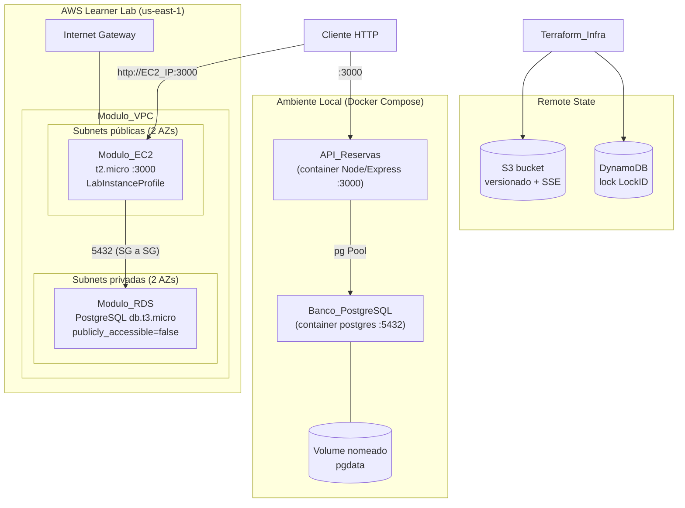
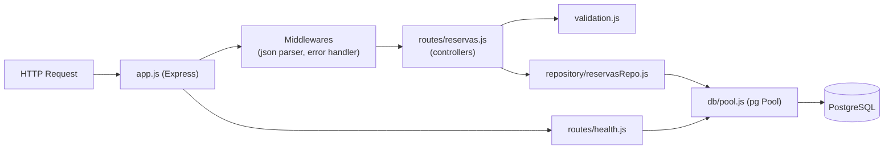
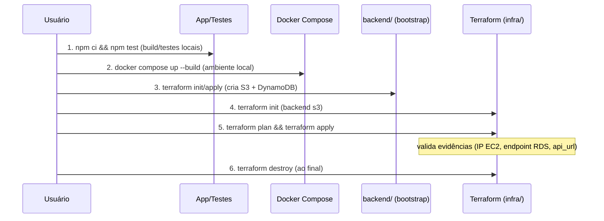

# Design Document

## Overview

Este documento descreve o design técnico da jornada DevOps completa da **API de Reservas** da TechNova, cobrindo a aplicação Node.js/Express com persistência em PostgreSQL via driver `pg` (sem ORM), a containerização com Docker, a orquestração local com Docker Compose e o provisionamento na AWS com Terraform modularizado e remote state, respeitando as restrições do AWS Academy Learner Lab.

O design atende aos requisitos definidos em `requirements.md` (Requisitos 1 a 18). O recurso central é `reservas` (`id`, `cliente`, `data`, `status`) com CRUD completo persistido **exclusivamente** em PostgreSQL, tanto localmente (Compose) quanto na nuvem (RDS).

### Decisões de arquitetura de alto nível

- **Sem ORM**: acesso ao banco via `pg` (node-postgres) usando um `Pool` de conexões e queries parametrizadas (`$1, $2, ...`) para evitar SQL injection (Req 1.1).
- **Camadas separadas**: `config` (conexão/env), `db` (pool e queries), `validation` (regras dos campos), `routes/controllers` (HTTP), `app` (montagem do Express) e `server` (bootstrap). Isso facilita testar a lógica de rotas com Supertest sem subir o processo real.
- **Schema criado por script SQL de init** (`init.sql`), montado no container Postgres do Compose e aplicado no RDS via user_data/migração. Sem framework de migração para manter o escopo simples.
- **Validação na aplicação + CHECK no banco**: a app valida (retorna 400 amigável) e a coluna `status` tem `CHECK` como defesa em profundidade.
- **Fluxo de execução manual**: todos os comandos que provisionam infraestrutura ou containers (`docker build`, `docker compose up`, `terraform init/plan/apply/destroy`) são executados **manualmente pelo usuário**, com passo a passo documentado. O design não automatiza esses comandos.

> **Nota sobre execução manual:** As seções de Testing Strategy e o fim deste documento trazem a ordem exata dos comandos. A ferramenta/agente não executa `apply`/`up` automaticamente; ela fornece os arquivos e o roteiro, e o usuário roda no seu terminal com credenciais do Learner Lab válidas.

## Architecture

### Visão geral do sistema



### Camadas da aplicação



### Fluxo de provisionamento (executado manualmente)



## Components and Interfaces

### Estrutura de diretórios

```
prova-primeiro-bimestre-devops/
├── README.md
├── .gitignore
├── .env.example
├── docker-compose.yml
├── app/
│   ├── package.json
│   ├── Dockerfile
│   ├── .dockerignore
│   ├── init.sql                 # schema da tabela reservas
│   └── src/
│       ├── server.js            # bootstrap: valida env, sobe HTTP
│       ├── app.js               # cria e configura o Express (exportável p/ testes)
│       ├── config.js            # lê variáveis de ambiente (DATABASE_URL / PG*)
│       ├── db/
│       │   └── pool.js          # cria e exporta o Pool do pg
│       ├── validation/
│       │   └── reservaValidation.js
│       ├── repository/
│       │   └── reservasRepo.js  # queries SQL parametrizadas
│       └── routes/
│           ├── reservas.js      # CRUD
│           └── health.js        # GET /health
│       └── __tests__/
│           └── reservas.test.js
└── infra/
    ├── providers.tf             # provider aws + backend "s3"
    ├── main.tf                  # composição dos módulos
    ├── variables.tf
    ├── outputs.tf
    ├── backend/                 # bootstrap do remote state (state local)
    │   ├── main.tf              # S3 + DynamoDB
    │   ├── variables.tf
    │   └── outputs.tf
    └── modules/
        ├── vpc/
        ├── security-group/
        ├── ec2/
        └── rds/
```

### Módulo de configuração (`config.js`)

Lê a configuração de conexão a partir de variáveis de ambiente. Aceita `DATABASE_URL` (connection string) ou variáveis discretas `PGHOST`, `PGPORT`, `PGUSER`, `PGPASSWORD`, `PGDATABASE`.

- Se nenhuma configuração de conexão estiver presente na inicialização, `server.js` **interrompe** com log de erro identificando a variável ausente e `process.exit(1)` (Req 1.5, Req 9.6).

### Repositório de dados (`reservasRepo.js`)

Interface (todas as funções recebem o `pool` ou usam o pool compartilhado e usam queries parametrizadas):

| Função | SQL (resumo) | Retorno |
|--------|--------------|---------|
| `create({cliente, data, status})` | `INSERT INTO reservas(...) VALUES ($1,$2,$3) RETURNING *` | Reserva criada com `id` |
| `findAll()` | `SELECT * FROM reservas ORDER BY id` | Array de Reservas |
| `findById(id)` | `SELECT * FROM reservas WHERE id = $1` | Reserva ou `null` |
| `update(id, {cliente, data, status})` | `UPDATE reservas SET ... WHERE id=$4 RETURNING *` | Reserva atualizada ou `null` |
| `remove(id)` | `DELETE FROM reservas WHERE id=$1 RETURNING id` | `true`/`false` |
| `ping()` | `SELECT 1` | usado pelo health check |

### Contrato das rotas HTTP

Formato de erro JSON padronizado em todas as respostas de erro:

```json
{ "error": { "campo": "cliente", "mensagem": "cliente é obrigatório e deve ter entre 1 e 255 caracteres" } }
```

Quando o erro não é de campo específico, `campo` pode ser omitido ou `null`.

#### `POST /reservas` (Req 2)

- Entrada: `{ "cliente": string, "data": string ISO 8601, "status"?: "pendente"|"confirmada"|"cancelada" }`
- `status` ausente → default `pendente` (Req 2.2).
- Sucesso: **201** com a Reserva criada incluindo `id` (Req 2.1).
- `cliente` inválido → **400** campo `cliente` (Req 2.3).
- `data` inválida/ausente → **400** campo `data` (Req 2.4).
- `status` inválido → **400** campo `status` (Req 2.5).
- Corpo não-JSON → **400** (Req 2.6, tratado pelo error handler do body-parser).
- Falha de INSERT → **500** sem `id` retornado (Req 2.7).

#### `GET /reservas` (Req 3)

- Sucesso: **200** com array (vazio se não há registros) em ≤ 2s (Req 3.1, 3.2).
- Falha de consulta → **500** (Req 3.3).

#### `GET /reservas/:id` (Req 4)

- Existe → **200** com a Reserva (Req 4.1).
- `id` com formato inválido → **400** (Req 4.3).
- `id` inexistente → **404** (Req 4.2).
- Falha de consulta → **500** (Req 4.4).

#### `PUT /reservas/:id` (Req 5)

- Todos os campos válidos e `id` existe → **200** com Reserva atualizada (Req 5.1).
- `id` inexistente → **404** (Req 5.2).
- `status` inválido → **400** (Req 5.3).
- `data` inválida → **400** (Req 5.4).
- Campo obrigatório ausente / `cliente` inválido → **400** listando os campos (Req 5.5).

#### `DELETE /reservas/:id` (Req 6)

- Existe → **204** corpo vazio (Req 6.1).
- Inexistente → **404** (Req 6.2).

#### `GET /health` (Req 7)

- Operacional e conexão com banco OK (`ping()`) → **200** em ≤ 2s (Req 7.1).
- Sem conexão com o banco → **503** com mensagem de indisponibilidade (Req 7.2).

### Ordem de validação de `id` vs existência

Para `GET/PUT/DELETE /reservas/:id`: primeiro valida o **formato** do `id` (400 se inválido, Req 4.3), depois consulta existência (404 se ausente). O formato do `id` depende do tipo escolhido (ver Data Models); com `SERIAL` inteiro, `id` não numérico → 400.

## Data Models

### Entidade Reserva

| Campo | Tipo (app) | Tipo (PostgreSQL) | Regras |
|-------|-----------|-------------------|--------|
| `id` | number | `SERIAL PRIMARY KEY` | gerado pelo banco, único, não nulo (Req 1.3) |
| `cliente` | string | `VARCHAR(255) NOT NULL` | não vazio, 1–255 chars (Req 1.3, 2.3) |
| `data` | string ISO 8601 | `TIMESTAMPTZ NOT NULL` | data ou data-hora ISO 8601 válida (Req 1.3, 2.4) |
| `status` | enum string | `VARCHAR(20) NOT NULL DEFAULT 'pendente' CHECK (...)` | `pendente`\|`confirmada`\|`cancelada` (Req 1.3, 2.2, 2.5) |

**Decisão sobre `id`:** usar `SERIAL` (inteiro autoincrementado). Simplicidade e validação de formato trivial (`id` deve ser inteiro positivo). Uma alternativa seria `UUID` (`gen_random_uuid()`); optamos por `SERIAL` para reduzir dependências e facilitar os testes.

### Schema de inicialização (`init.sql`)

```sql
CREATE TABLE IF NOT EXISTS reservas (
    id       SERIAL PRIMARY KEY,
    cliente  VARCHAR(255) NOT NULL CHECK (char_length(trim(cliente)) BETWEEN 1 AND 255),
    data     TIMESTAMPTZ NOT NULL,
    status   VARCHAR(20) NOT NULL DEFAULT 'pendente'
             CHECK (status IN ('pendente', 'confirmada', 'cancelada'))
);
```

**Estratégia de criação do schema:**
- **Local (Compose):** `init.sql` montado em `/docker-entrypoint-initdb.d/` do container Postgres — executado automaticamente na primeira inicialização do volume.
- **Nuvem (RDS):** o RDS não executa scripts de init. O schema é aplicado pelo `user_data` da EC2 (ex.: `psql "$DATABASE_URL" -f init.sql`) ou na primeira subida da API, garantindo idempotência com `CREATE TABLE IF NOT EXISTS`.

### Regras de validação (`reservaValidation.js`)

- `cliente`: string após `trim()` com comprimento entre 1 e 255.
- `data`: parseável como ISO 8601 (`Date` válido); rejeita formatos fora do padrão.
- `status`: quando presente, deve pertencer ao enum; ausente no POST → default `pendente`.
- Corpo não-JSON: capturado pelo error handler global → 400 (Req 2.6).

### Variáveis de ambiente

| Variável | Descrição | Exemplo (`.env.example`) |
|----------|-----------|--------------------------|
| `DATABASE_URL` | Connection string completa | `postgres://reservas:senha@db:5432/reservas` |
| `PGHOST` | Host do banco (alternativa) | `db` |
| `PGPORT` | Porta | `5432` |
| `PGUSER` | Usuário | `reservas` |
| `PGPASSWORD` | Senha (vazio no example) | `` |
| `PGDATABASE` | Nome do banco | `reservas` |
| `PORT` | Porta HTTP da API | `3000` |

`.env` fica no `.gitignore` (Req 10.8); `.env.example` versionado sem senhas reais (Req 10.7).

## Correctness Properties

*Uma propriedade é uma característica ou comportamento que deve permanecer verdadeiro em todas as execuções válidas do sistema — essencialmente, uma afirmação formal sobre o que o sistema deve fazer. Propriedades servem de ponte entre especificações legíveis por humanos e garantias de correção verificáveis por máquina.*

As propriedades abaixo cobrem o **núcleo lógico do CRUD e da validação** da `API_Reservas`, que é onde a saída varia de forma significativa com a entrada e onde 100+ iterações revelam casos de borda. As camadas de containerização (Req 9–10) e infraestrutura Terraform (Req 11–17) **não** são cobertas por property-based testing por serem configuração declarativa/IaC — para elas a Testing Strategy define testes de snapshot/integração e policy checks.

### Property 1: Round-trip criar → buscar preserva os dados

*Para toda* Reserva válida (cliente com 1–255 caracteres, `data` ISO 8601 válida, `status` no enum), quando ela é criada via `POST /reservas` (resposta 201 com `id` gerado) e depois buscada via `GET /reservas/:id`, a Reserva retornada deve conter os mesmos `cliente`, `data` e `status` enviados, além do `id` gerado.

**Validates: Requirements 1.2, 1.3, 2.1, 4.1**

### Property 2: `status` ausente assume o valor padrão `pendente`

*Para toda* Reserva válida enviada em `POST /reservas` **sem** o campo `status`, a Reserva criada e persistida deve ter `status` igual a `pendente`.

**Validates: Requirements 2.2**

### Property 3: Entrada inválida em criação nunca é persistida

*Para toda* entrada de `POST /reservas` que viole ao menos uma regra de validação (`cliente` ausente/vazio/maior que 255, `data` ausente ou fora do formato ISO 8601, ou `status` fora de `{pendente, confirmada, cancelada}`), a API deve responder com HTTP 400 indicando o campo inválido e o total de reservas armazenadas deve permanecer inalterado.

**Validates: Requirements 1.7, 2.3, 2.4, 2.5**

### Property 4: A listagem reflete exatamente as inserções

*Para toda* sequência de N (N ≥ 0) Reservas válidas inseridas em um banco inicialmente vazio, `GET /reservas` deve retornar HTTP 200 com uma coleção de tamanho N contendo exatamente as reservas inseridas (mesmos `cliente`, `data`, `status`).

**Validates: Requirements 3.1, 3.2**

### Property 5: Round-trip de atualização reflete os novos dados

*Para toda* Reserva existente e todo conjunto de novos dados válidos (`cliente`, `data`, `status`), quando `PUT /reservas/:id` é aplicado (resposta 200), um `GET /reservas/:id` subsequente deve retornar a Reserva com os novos valores e o mesmo `id`.

**Validates: Requirements 5.1**

### Property 6: Atualização inválida nunca altera o estado

*Para toda* Reserva existente e todo payload de `PUT /reservas/:id` que viole as regras de validação (campo obrigatório ausente, `cliente` vazio/maior que 255, `data` fora de ISO 8601 ou `status` fora do enum), a API deve responder com HTTP 400 e a Reserva armazenada deve permanecer idêntica ao seu estado anterior.

**Validates: Requirements 5.3, 5.4, 5.5**

### Property 7: Remover torna a busca subsequente um 404

*Para toda* Reserva existente, `DELETE /reservas/:id` deve responder com HTTP 204 e um `GET /reservas/:id` subsequente do mesmo `id` deve responder com HTTP 404.

**Validates: Requirements 6.1**

### Property 8: Busca por `id` inexistente resulta em 404

*Para todo* `id` com formato válido que não corresponde a nenhuma Reserva armazenada, `GET /reservas/:id` deve responder com HTTP 404 e mensagem indicando que a reserva não foi encontrada.

**Validates: Requirements 4.2**

## Error Handling

### Estratégia geral

- **Middleware de erro global** no Express captura exceções e normaliza o corpo de erro para `{ "error": { "campo"?, "mensagem" } }`.
- **Erro de parsing JSON**: o middleware `express.json()` lança `SyntaxError` para corpos malformados; o error handler mapeia para **400** com mensagem de corpo inválido (Req 2.6).
- **Erros de validação**: as funções de validação retornam a lista de campos inválidos; o controller responde **400** identificando o(s) campo(s) sem tocar o banco (Req 1.7, 2.3–2.5, 5.3–5.5).
- **Recurso não encontrado**: repositório retorna `null`/`false`; controller responde **404** (Req 4.2, 5.2, 6.2).
- **Formato de `id` inválido**: `id` não inteiro → **400** antes de consultar o banco (Req 4.3).
- **Falhas do banco durante CRUD**: erros do `pg` (conexão perdida, query falha) são capturados e mapeados para **500** com mensagem de falha, sem persistência parcial — operações de escrita usam uma única instrução com `RETURNING`, evitando estados intermediários (Req 1.6, 2.7, 3.3, 4.4).

### Inicialização e saúde

- **Env de conexão ausente na inicialização**: `server.js` valida a configuração antes de subir o HTTP; se ausente, loga a variável faltante e encerra com `process.exit(1)` (Req 1.5, 9.6).
- **Health check**: `GET /health` executa `SELECT 1`; sucesso → **200**, falha de conexão → **503** (Req 7.1, 7.2).

### Container

- Se o container inicia mas não consegue conectar ao banco, a aplicação loga o erro e encerra com código de saída ≠ 0, sinalizando falha ao orquestrador (Req 9.6).

### Terraform / Learner Lab

- **Session Token ausente/expirado**: o provider AWS retorna `ExpiredToken`; a operação é interrompida sem provisionar recursos (Req 17.5). O roteiro manual orienta reiniciar o Lab e atualizar credenciais.
- **Lock concorrente**: o backend S3+DynamoDB retém o lock; uma segunda execução falha com erro de lock identificando o detentor, sem modificar o estado (Req 16.4).
- **Backend indisponível**: se S3/DynamoDB estão inacessíveis, a operação é interrompida com erro identificando o backend (Req 16.5).
- **Falha parcial de módulos**: falha em subnet/VPC (Req 11.4) ou RDS (Req 14.6) interrompe o `apply`; recursos criados podem ser removidos com `terraform destroy` para evitar estado parcial persistido.

## Testing Strategy

A estratégia combina **testes de propriedade** (núcleo lógico do CRUD/validação), **testes de exemplo/unitários** (casos específicos e de erro) e **testes de integração/inspeção** (Docker, Compose, Terraform). Todos os comandos que sobem containers ou infraestrutura são executados **manualmente pelo usuário** (ver Fluxo de Execução Manual).

### Testes da aplicação (Jest + Supertest) — Req 8

- **Ferramentas**: Jest como runner e Supertest para exercitar as rotas HTTP a partir do `app` exportado (sem depender de porta real) — Req 8.1.
- **Biblioteca de property-based testing**: usar [`fast-check`](https://github.com/dubzzz/fast-check) integrada ao Jest. **Não** implementar PBT do zero.
- **Preparação/isolamento do banco para testes**:
  - Estratégia primária: subir um PostgreSQL de teste (container dedicado ou o serviço `db` do Compose) e, antes de cada teste/propriedade, truncar a tabela `reservas` (`TRUNCATE reservas RESTART IDENTITY`) para garantir estado inicial limpo e determinístico.
  - Cada execução de propriedade cria seu próprio conjunto de dados e limpa ao final; geradores produzem `cliente` (1–255 chars, incluindo bordas e whitespace), `data` (ISO 8601 válida e inválida) e `status` (enum e valores fora do enum).
  - Para os casos de falha de banco (Req 1.6, 2.7, 3.3, 4.4, 7.2) usar **mocks** do repositório/pool que lançam erro, isolando a lógica HTTP da infraestrutura.

#### Mapeamento propriedade → teste

Cada propriedade de correção é implementada por **um único** teste property-based, com **mínimo de 100 iterações** e uma tag referenciando a propriedade do design:

- Formato da tag: **`Feature: api-reservas-devops, Property {número}: {texto da propriedade}`**
- Configuração: `fc.assert(fc.property(...), { numRuns: 100 })` (no mínimo).

| Propriedade | Teste | Iterações |
|-------------|-------|-----------|
| Property 1 (round-trip create→get) | gera reserva válida, POST, GET/:id, compara campos | ≥ 100 |
| Property 2 (default `pendente`) | gera reserva válida sem status, POST, verifica status | ≥ 100 |
| Property 3 (POST inválido não persiste) | gera entrada inválida, POST → 400, conta reservas inalterada | ≥ 100 |
| Property 4 (list reflete inserts) | insere N reservas, GET, compara conjunto e tamanho | ≥ 100 |
| Property 5 (update round-trip) | cria, PUT válido, GET reflete novos dados | ≥ 100 |
| Property 6 (update inválido não altera) | cria, PUT inválido → 400, estado inalterado | ≥ 100 |
| Property 7 (delete → get 404) | cria, DELETE 204, GET → 404 | ≥ 100 |
| Property 8 (id inexistente → 404) | gera id ausente, GET → 404 | ≥ 100 |

#### Testes de exemplo / unitários (complementares)

- **Casos de sucesso por rota** (Req 8.2): POST→201, GET→200, GET/:id→200, PUT→200, DELETE→204.
- **Validação → 400** com corpo indicando o motivo (Req 8.3).
- **Recurso inexistente → 404** (Req 8.4).
- **Casos de erro específicos**: corpo não-JSON → 400 (2.6); falha de INSERT/consulta → 500 com mock (2.7, 3.3, 4.4); `id` formato inválido → 400 (4.3); DELETE/PUT inexistente → 404 (5.2, 6.2); `/health` 200 e 503 (7.1, 7.2); inicialização sem env → exit ≠ 0 (1.5).
- **Restrições de tempo**: a suíte completa deve concluir em ≤ 60s e reportar aprovação/reprovação por teste (Req 8.5). As respostas de rotas de leitura/escrita devem observar o limite de ≤ 2s (Req 3.1, 4.1, 5.1, 6.1, 7.x).

### Testes de containerização (Docker) — Req 9

Não são property-based (empacotamento/IaC). Estratégia por inspeção e integração:
- Inspeção do `Dockerfile`: presença de múltiplos estágios (multi-stage, Req 9.3) e diretiva `USER` não-root (Req 9.2).
- `.dockerignore` exclui `node_modules`, `.env`, artefatos de teste e `.git` (Req 9.4).
- Teste de integração: `docker build`, `docker run` com env válida e verificação de resposta HTTP em ≤ 30s (Req 9.5); teste de container sem conexão verificando exit code ≠ 0 (Req 9.6).

### Testes de orquestração local (Docker Compose) — Req 10

- `docker compose config` valida a definição dos serviços `api` e `db`, volume nomeado, rede bridge customizada, healthcheck (`pg_isready`, intervalo ≤ 10s, ≤ 5 retries) e `depends_on: condition: service_healthy` (Req 10.1–10.6).
- Verificar `.env.example` versionado sem senhas (Req 10.7) e `.env` no `.gitignore` (Req 10.8).
- Teste de subida: `docker compose up` e checagem de `service_healthy` do banco antes da API iniciar.

### Testes de infraestrutura (Terraform) — Req 11–17

Não são property-based (IaC declarativa). Estratégia por `validate`/`plan`/snapshot e policy checks:
- `terraform validate` e `terraform plan` em cada módulo e na composição raiz.
- Snapshot/asserções sobre o plan: 2 subnets públicas + 2 privadas em 2 AZs (Req 11); regras de SG (22/3000 no EC2; 5432 só do SG EC2 no RDS — Req 12, 15.2); `t2.micro` (Req 13.1); `db.t3.micro`, `publicly_accessible=false`, `storage_encrypted=true` (Req 14); presença dos outputs `ec2_public_ip`, `rds_endpoint`, `api_url` (Req 15).
- Remote state: verificar bucket S3 versionado + SSE e tabela DynamoDB com chave `LockID`, e `backend "s3"` configurado (Req 16).
- **Policy check Learner Lab**: garantir que o código não declara `aws_iam_user`, `aws_iam_group` nem `aws_iam_role`; região `us-east-1`; uso de `LabRole`/`LabInstanceProfile` (Req 17).

### Verificação do README — Req 18

- Checagem de conteúdo: `README.md` contém "Fernanda Novais", "4025109" e um parágrafo de descrição (Req 18.1–18.4).

## Fluxo de Execução Manual (passo a passo)

Todos os comandos abaixo são executados **manualmente pelo usuário** no seu terminal. O design fornece os arquivos; nada é aplicado automaticamente. Ordem recomendada:

1. **Build e testes locais da API**
   ```bash
   cd app
   npm ci
   npm test            # Jest + Supertest + fast-check (>=100 iterações por propriedade)
   ```
2. **Ambiente local com Docker Compose** (API + PostgreSQL)
   ```bash
   cp .env.example .env      # preencher senha localmente (não versionar)
   docker compose up --build # aguarda db saudável (healthcheck) antes de subir a API
   docker compose ps         # evidência
   curl http://localhost:3000/health
   ```
3. **Bootstrap do Remote State** (cria S3 + DynamoDB — state local neste passo)
   ```bash
   cd infra/backend
   terraform init
   terraform apply           # cria bucket S3 (versionado+SSE) e tabela DynamoDB (LockID)
   ```
4. **Init do projeto principal com backend S3**
   ```bash
   cd ../                    # infra/
   terraform init            # configura o backend "s3" apontando para o bucket/tabela criados
   ```
5. **Plan e Apply da infraestrutura** (VPC, SG, EC2, RDS, composição)
   ```bash
   terraform plan -out=tfplan   # gerar evidência terraform-plan.txt
   terraform apply tfplan
   terraform output             # ec2_public_ip, rds_endpoint, api_url (http://IP:3000)
   ```
   A EC2 recebe a connection string do RDS via `user_data`/variáveis de ambiente e sobe a API na porta 3000, aplicando o schema (`init.sql`) no RDS.
6. **Destroy ao final** (obrigatório no Learner Lab para não esgotar créditos)
   ```bash
   terraform destroy         # infra/ (VPC, SG, EC2, RDS)
   cd backend && terraform destroy   # remove S3 + DynamoDB do remote state
   ```

> **Learner Lab:** região sempre `us-east-1`; credenciais temporárias com Session Token (AWS Details → AWS CLI). Se `terraform` retornar `ExpiredToken`, reiniciar o Lab e atualizar `~/.aws/credentials`. Não criar recursos IAM — usar `LabRole`/`LabInstanceProfile`.
