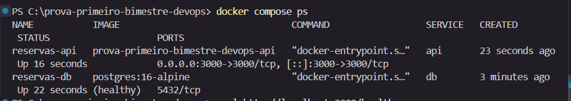
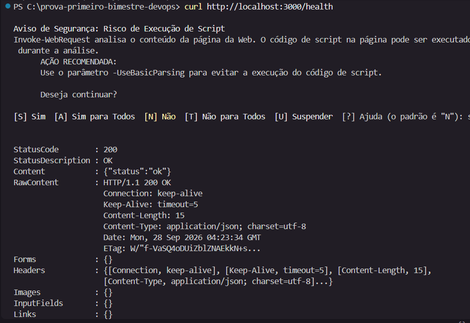

PS C:\prova-primeiro-bimestre-devops> docker compose ps                
NAME           IMAGE                                COMMAND                  SERVICE   CREATED          STATUS                    PORTS
reservas-api   prova-primeiro-bimestre-devops-api   "docker-entrypoint.s…"   api       23 seconds ago   Up 16 seconds             0.0.0.0:3000->3000/tcp, [::]:3000->3000/tcp
reservas-db    postgres:16-alpine                   "docker-entrypoint.s…"   db        3 minutes ago    Up 22 seconds (healthy)   5432/tcp
PS C:\prova-primeiro-bimestre-devops> curl http://localhost:3000/health
                                                                                                       
Aviso de Segurança: Risco de Execução de Script                                                        
Invoke-WebRequest analisa o conteúdo da página da Web. O código de script na página pode ser executado 
 durante a análise.                                                                                    
      AÇÃO RECOMENDADA:
      Use o parâmetro -UseBasicParsing para evitar a execução do código de script.

      Deseja continuar?
    
[S] Sim  [A] Sim para Todos  [N] Não  [T] Não para Todos  [U] Suspender  [?] Ajuda (o padrão é "N"): s

StatusCode        : 200
StatusDescription : OK
Content           : {"status":"ok"}
RawContent        : HTTP/1.1 200 OK
                    Connection: keep-alive
                    Keep-Alive: timeout=5
                    Content-Length: 15
                    Content-Type: application/json; charset=utf-8
                    Date: Mon, 28 Sep 2026 04:23:34 GMT
                    ETag: W/"f-VaSQ4oDUiZblZNAEkkN+s...
Forms             : {}
Headers           : {[Connection, keep-alive], [Keep-Alive, timeout=5], [Content-Length, 15], 
                    [Content-Type, application/json; charset=utf-8]...}
Images            : {}
InputFields       : {}
Links             : {}
ParsedHtml        : mshtml.HTMLDocumentClass
RawContentLength  : 15

PS C:\prova-primeiro-bimestre-devops> 

