# Evidências de Execução — API de Reservas DevOps

**Aluna:** Fernanda Novais — **RA:** 4025109
**Região AWS:** us-east-1 (AWS Academy Learner Lab)

Este documento reúne as evidências de execução do projeto nas etapas de
containerização (Docker e Docker Compose) e de provisionamento da
infraestrutura na AWS com Terraform.

---

## 1. Docker Compose (API + PostgreSQL)

### 1.1. Serviços no ar (`docker compose ps`)

```text
NAME           IMAGE                                COMMAND                  SERVICE   CREATED          STATUS                    PORTS
reservas-api   prova-primeiro-bimestre-devops-api   "docker-entrypoint.s…"   api       23 seconds ago   Up 16 seconds             0.0.0.0:3000->3000/tcp, [::]:3000->3000/tcp
reservas-db    postgres:16-alpine                   "docker-entrypoint.s…"   db        3 minutes ago    Up 22 seconds (healthy)   5432/tcp
```

O serviço `db` fica `healthy` (healthcheck `pg_isready`) antes de a `api` iniciar.


### 1.2. Health check (`GET /health`)

```powershell
PS C:\prova-primeiro-bimestre-devops> curl http://localhost:3000/health
```

```text
StatusCode        : 200
StatusDescription : OK
Content           : {"status":"ok"}
RawContent        : HTTP/1.1 200 OK
                    Content-Length: 15
                    Content-Type: application/json; charset=utf-8
```

> Observação: o PowerShell exibe um "Aviso de Segurança" ao usar `curl`
> (alias de `Invoke-WebRequest`). Para evitar, usar `-UseBasicParsing` ou `curl.exe`.


### 1.3. Criação de reserva (`POST /reservas`)

```powershell
PS C:\prova-primeiro-bimestre-devops> curl.exe -X POST "http://localhost:3000/reservas" -H "Content-Type: application/json" -d '{\"cliente\":\"Fernanda\",\"data\":\"2025-02-15T10:00:00Z\"}'
```

```json
{"id":2,"cliente":"Fernanda","data":"2025-02-15T10:00:00.000Z","status":"pendente"}
```

Confirma o CRUD funcionando e o `status` assumindo o valor padrão `pendente`.

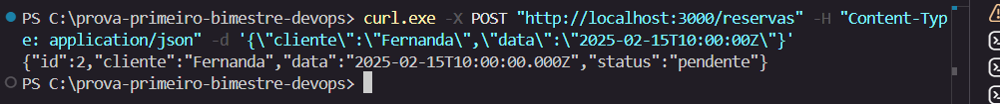

### 1.4. Encerramento do ambiente (`docker compose down`)

```text
[+] down 3/3
 OK Container reservas-api                              Removed
 OK Container reservas-db                               Removed
 OK Network prova-primeiro-bimestre-devops_reservas-net Removed
```

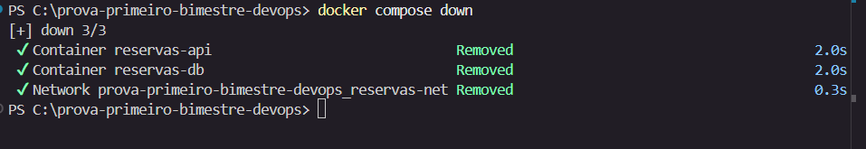

---

## 2. Docker (build da imagem isolada)

```powershell
PS C:\prova-primeiro-bimestre-devops\app> docker build -t api-reservas .
```

```text
[+] Building 3.2s (15/15) FINISHED                                docker:desktop-linux
 => [internal] load build definition from Dockerfile
 => [internal] load metadata for docker.io/library/node:20-alpine
 => [build 1/5] FROM docker.io/library/node:20-alpine
 => [build 2/5] WORKDIR /app
 => [build 3/5] COPY package.json package-lock.json ./
 => [build 4/5] RUN npm ci
 => [build 5/5] COPY . .
 => [runtime 4/6] RUN npm ci --omit=dev && npm cache clean --force
 => [runtime 5/6] COPY --from=build /app/src ./src
 => [runtime 6/6] COPY --from=build /app/init.sql ./init.sql
 => naming to docker.io/library/api-reservas:latest
```

Build multi-stage concluído com sucesso (imagem `api-reservas:latest`).

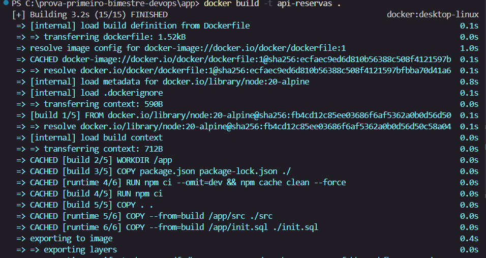

---

## 3. Ferramentas e autenticação

### 3.1. Versões das ferramentas

```powershell
PS C:\prova-primeiro-bimestre-devops> terraform version
Terraform v1.15.8
on windows_amd64
```

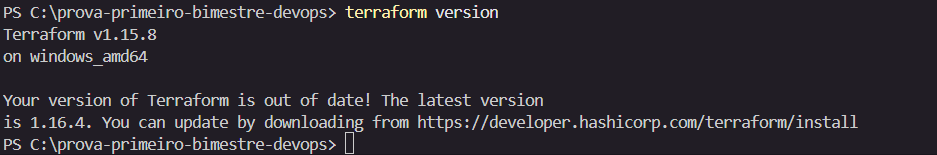

```powershell
PS C:\prova-primeiro-bimestre-devops> aws --version
aws-cli/2.35.4 Python/3.14.5 Windows/11 exe/AMD64
```

### 3.2. Autenticação no Learner Lab (`aws sts get-caller-identity`)

```json
{
    "UserId": "AROAW27QUBV7DMWUNCAJP:user5395076=Fernanda_",
    "Account": "470266678654",
    "Arn": "arn:aws:sts::470266678654:assumed-role/voclabs/user5395076=Fernanda_"
}
```

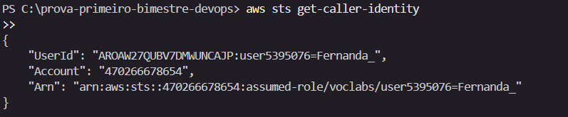

---

## 4. Infraestrutura AWS (Terraform)

### 4.1. Adaptação do remote state (backend local)

O bootstrap do remote state em S3 + DynamoDB foi bloqueado por uma Service
Control Policy (SCP) da organização do Learner Lab, que nega ações de
gerenciamento de S3 usadas pelo provider:

```text
Error: reading S3 Bucket (api-reservas-devops-tfstate) object lock configuration:
api error AccessDenied: ... is not authorized to perform:
s3:GetBucketObjectLockConfiguration ... with an explicit deny in a service control policy
```

Decisão: manter o código do remote state (S3 versionado + SSE e DynamoDB com
`LockID`) versionado como evidência da implementação, mas usar **backend local**
no Learner Lab. O bloco `backend "s3"` foi comentado em `infra/providers.tf`.

### 4.2. Plan e Apply (`terraform apply`)

Resumo do plano de execução:

```text
Plan: 22 to add, 0 to change, 0 to destroy.

Changes to Outputs:
  + api_url               = (known after apply)
  + ec2_public_ip         = (known after apply)
  + ec2_security_group_id = (known after apply)
  + private_subnet_ids    = [ (known after apply), (known after apply) ]
  + public_subnet_ids     = [ (known after apply), (known after apply) ]
  + rds_endpoint          = (known after apply)
  + rds_security_group_id = (known after apply)
  + vpc_id                = (known after apply)
```

Recursos criados (22 no total): VPC, Internet Gateway, 2 subnets públicas +
2 privadas (us-east-1a / us-east-1b), route tables e associações, Security
Groups (EC2 e RDS) e suas regras, DB subnet group, instância RDS PostgreSQL
`db.t3.micro` (`storage_encrypted=true`, `publicly_accessible=false`) e a
instância EC2 `t2.micro` com `LabInstanceProfile`.

Trecho da execução:

```text
module.vpc.aws_vpc.this: Creation complete after 4s [id=vpc-02b1b2ca1ebfc9924]
module.security_group.aws_security_group.rds: Creation complete after 3s [id=sg-0722b6b53248ff9f4]
module.security_group.aws_security_group.ec2: Creation complete after 3s [id=sg-0122c5cbc6bbfaf8b]
module.rds.aws_db_subnet_group.this: Creation complete after 2s [id=api-reservas-rds-subnet-group]
module.rds.aws_db_instance.this: Still creating... [05m20s elapsed]
module.rds.aws_db_instance.this: Creation complete after 5m20s [id=db-BM3WNB6DYSQ52A327VQM2CUJDE]
module.ec2.aws_instance.this: Creation complete after 16s [id=i-0483077e71b33e889]

Apply complete! Resources: 22 added, 0 changed, 0 destroyed.
```

### 4.3. Outputs da infraestrutura (`terraform output`)

```text
api_url = "http://44.212.66.226:3000"
ec2_public_ip = "44.212.66.226"
ec2_security_group_id = "sg-0122c5cbc6bbfaf8b"
private_subnet_ids = [
  "subnet-0e46dd1a09f9b1658",
  "subnet-0acafb88f49bbae57",
]
public_subnet_ids = [
  "subnet-0e79b639081693d18",
  "subnet-0366bf4456ebb50f3",
]
rds_endpoint = "api-reservas-dev-rds.cjofyhvmjzqi.us-east-1.rds.amazonaws.com:5432"
rds_security_group_id = "sg-0722b6b53248ff9f4"
vpc_id = "vpc-02b1b2ca1ebfc9924"
```

### 4.4. Problemas encontrados e soluções

**Problema 1 — EC2 buscava o código no Git antes do push.**
O `user_data` da EC2 clona o repositório da aplicação. Nas primeiras tentativas
o código ainda não havia sido enviado ao GitHub, então a instância não tinha o
que clonar. Solução: fazer o commit/push do projeto antes de recriar a EC2.

**Problema 2 — RDS recusou a conexão sem SSL.**
O RDS PostgreSQL gerenciado exige conexão criptografada. O log da aplicação
mostrava `no pg_hba.conf entry for host ..., no encryption`. Solução:
- Setar `PGSSL=require` no ambiente do serviço systemd (para o `pg` conectar com SSL).
- Aplicar o `init.sql` com SSL exigido (`psql` com `sslmode=require`).


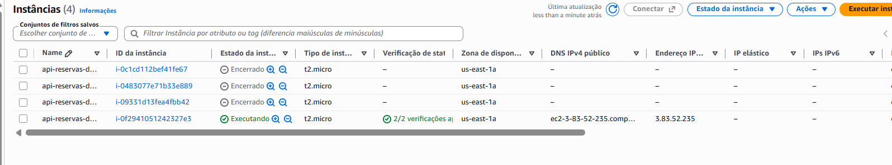
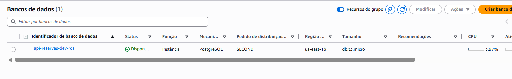
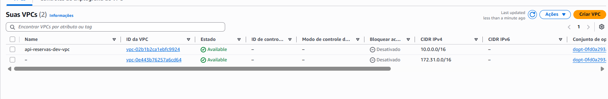
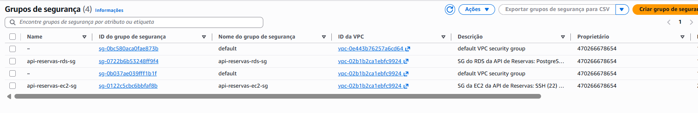
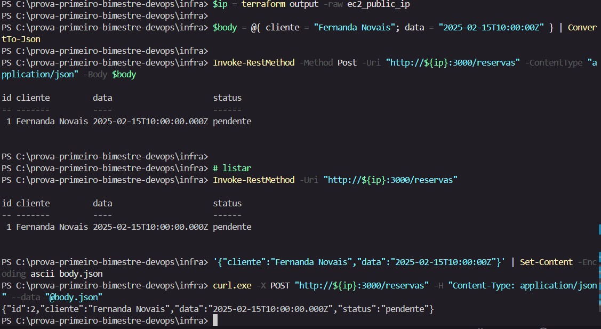

### 4.5. Validação da API na nuvem

```powershell
PS C:\prova-primeiro-bimestre-devops\infra> $ip = terraform output -raw ec2_public_ip
PS C:\prova-primeiro-bimestre-devops\infra> curl.exe "http://${ip}:3000/health"
{"status":"ok"}
```

```powershell
PS C:\prova-primeiro-bimestre-devops\infra> curl.exe "http://${ip}:3000/reservas"
[]
```

A API respondeu `200 {"status":"ok"}` no health check e `200 []` na listagem,
comprovando a stack completa funcionando na nuvem (EC2 -> RDS PostgreSQL via SSL).

---

## 5. Destroy da infraestrutura (`terraform destroy`)

Executado ao final para não consumir créditos do Learner Lab.

```text
module.rds.aws_db_instance.this: Still destroying... [01m50s elapsed]
module.rds.aws_db_instance.this: Destruction complete after 1m52s
module.rds.aws_db_subnet_group.this: Destruction complete after 0s
module.vpc.aws_subnet.private[1]: Destruction complete after 1s
module.vpc.aws_subnet.private[0]: Destruction complete after 2s
module.security_group.aws_security_group.rds: Destruction complete after 2s
module.vpc.aws_vpc.this: Destruction complete after 1s

Destroy complete! Resources: 22 destroyed.
```

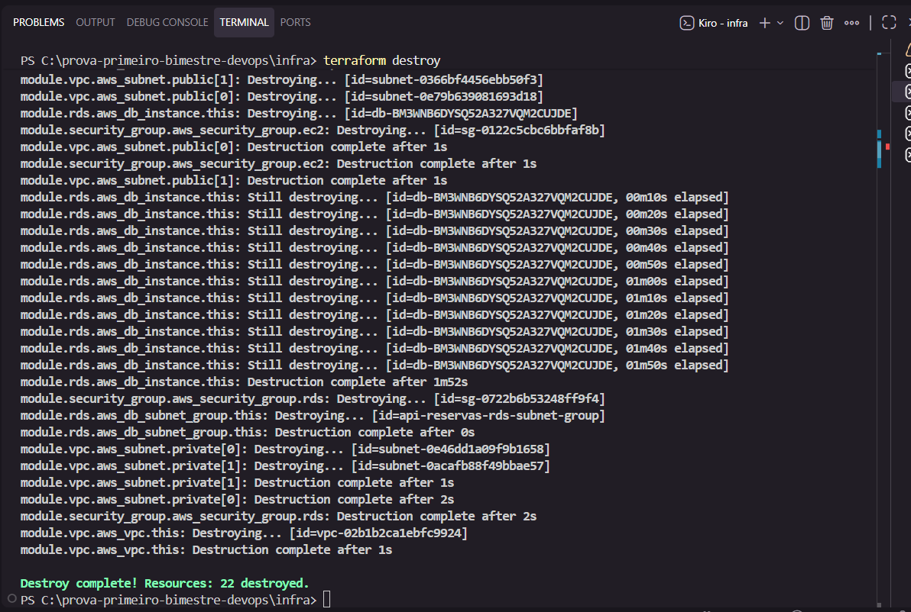